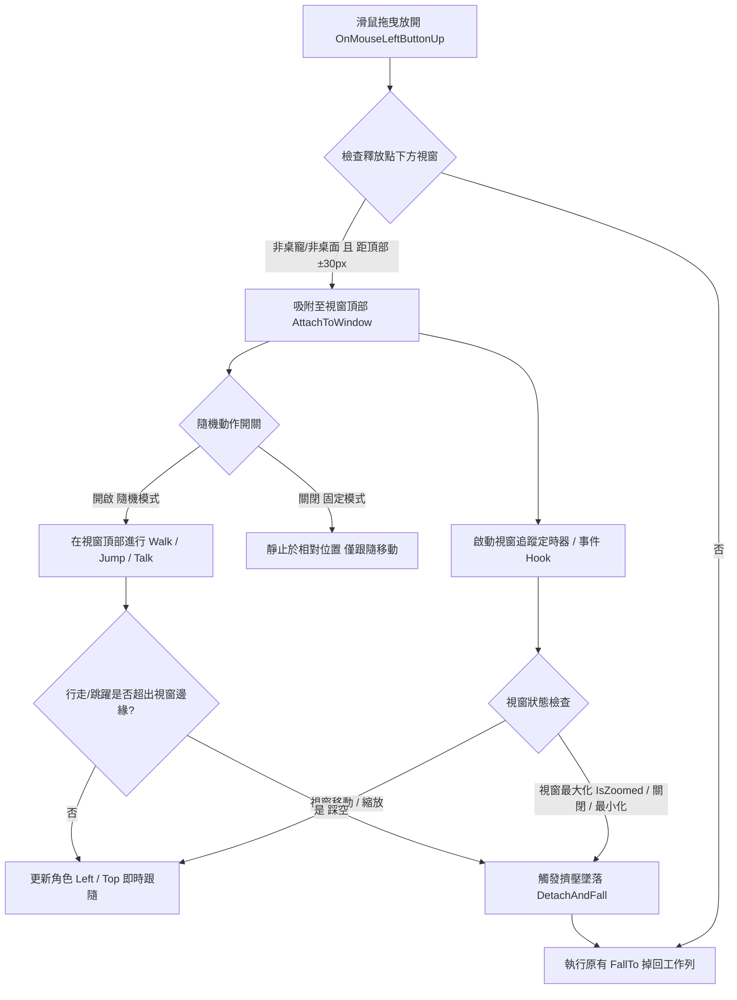

# ChiikawaDesktopPet (吉伊卡哇桌面寵物)

基於 **C# / .NET 10 WPF** 打造的高效能、輕量化吉伊卡哇桌面寵物應用程式。

本專案完全重構自社群開源的 Python/PyQt6 實作，具備極致輕量的執行體積、原生 Windows 桌面流暢度與完整的互動支援。

---

## ✨ 特色功能 (Features)

* **輕量與原生體驗**：基於 .NET 10 WPF，以無邊框、背景透明、永遠置頂視窗呈現，單檔發布大小僅約 **2.3 MB**。
* **靜音辦公友善 (Office-Friendly)**：全域完全無突發音效干擾，安心在辦公室與專注工作環境中陪伴。
* **多位人氣與趣味角色完整登場**：
  * **吉伊卡哇 (Chiikawa)**
  * **小八貓 (Hachiware)**
  * **兔兔烏薩奇 (Usagi)**（包含旋轉舞、狂歡跳舞等多種專屬動作）
  * **小桃 (Momonga)**（包含裝可愛、生氣跺腳等特色動作）
  * **自嘲熊 (JokeBear)**（包含待機循環彈跳、狂歡跳舞、崩潰搥地、吃拉麵等豐富動作）
  * **愛心兔 (LOVE RABBIT)**（來自西村裕二作品，包含待機循環律動、發送愛心、狂歡跳舞、派對狂歡、痛哭流涕等豐富動作）
  * **總統-賴 (Lai)**（包含「不是不是喔」、加油比讚等趣味動作）
* **生動的自主行為**：角色會在桌面自主漫步、跳躍、發呆或進行特色動作演繹。
* **豐富的滑鼠互動與獨立選單**：
  * **右鍵專屬功能表**：直接在角色上按右鍵可手動觸發各項動作、切換隨機跳躍/漫步、設定對話文字與字體大小。
  * **角色比例自由縮放 (Scale Adjustment)**：右鍵選單提供 50% ~ 200% 常用預設比例與 20% ~ 400% 自訂比例視窗，在大螢幕或高解析度螢幕上也能自由放大/縮小角色且維持清晰平滑畫質。
  * **拖曳移動**：隨意抓起角色放到螢幕任意位置。
  * **長按搖晃 (Hold-to-Shake)**：抓住太久角色會進入掙扎搖晃狀態。
  * **自由落體 (Fall-to-Ground)**：放開滑鼠後角色會受重力自然墜落並平穩著地於工作列頂部。
  * **視窗吸附與互動 (Window Snapping & Interaction)**：
    * **智慧吸附停靠**：將角色拖曳至任何一般應用程式視窗（如瀏覽器、記事本、IDE 等）頂部標題列邊緣釋放，角色會自動吸附並站立於視窗上緣。
    * **視窗即時跟隨**：無論是自由活動或取消隨機動作的「固定模式」，角色皆會即時跟隨視窗移動與縮放。
    * **邊緣踩空墜落**：在視窗上漫步或跳躍時，一旦超出視窗邊緣踩空，會立即中斷當前動作並切換為空中墜落動作掉回工作列。
    * **最大化擠壓與失效防護**：視窗最大化（頂部空間受擠壓）或視窗最小化/關閉時，角色自動解除吸附並安全墜落回工作列。
* **系統匣快捷控制 (System Tray)**：
  * 繁體中文右鍵功能表。
  * 隨時生成 (Spawn) 或移除 (Kick) 任意角色。
  * 打招呼 (Say Hi) 互動與即時氣泡提示。
  * 支援 **「限制角色只能在單一螢幕內移動」** 切換，友善多螢幕工作環境。
* **高 DPI 與多螢幕校正**：具備螢幕座標轉換、多螢幕跨屏跳躍防漂移與工作列自動貼齊防穿透。

---

## 🔄 視窗吸附與行為互動流程 (Window Interaction Flow)



---

## 🏗️ 專案架構 (Architecture)

```
src/
  ├── YahaPet.Core/               純 C# 核心類別庫（無 UI 依賴，包含完全可單元測試的移動、跳躍、邊界判定邏輯）
  ├── YahaPet.Core.Tests/         核心決策邏輯 xUnit 單元測試
  ├── YahaPet.Wpf/                WPF 桌面應用程式（系統匣控制、透明視窗與流暢動畫播放器）
  ├── YahaPet.Wpf.Tests/          WPF 層元件單元測試
  ├── YahaPet.AssetPipeline/      獨立素材批次重取樣與壓縮工具（Frame Resampling & Image Optimization）
  └── YahaPet.AssetPipeline.Tests/素材處理管線單元測試
```

---

## 🚀 開發與建置 (Development & Build)

### 需求條件
* [.NET 10.0 SDK](https://dotnet.microsoft.com/download/dotnet/10.0) 或更高版本
* Windows 10 / 11

### 本地執行
```powershell
dotnet run --project src/YahaPet.Wpf
```

### 執行單元測試
```powershell
dotnet test src/YahaPet.sln
```

### 發布專案 (Publish)

#### 1. 輕量單檔發布（需本機已安裝 .NET 10 Desktop Runtime，體積僅約 ~2.3 MB）
```powershell
dotnet publish src/YahaPet.Wpf/YahaPet.Wpf.csproj -c Release -r win-x64 --self-contained false -p:PublishSingleFile=true -o publish
```
發布後直接將 `publish/` 資料夾打包分享即可。

#### 2. 自包含獨立發布（無需安裝 .NET Runtime，體積約 ~157 MB）
```powershell
dotnet publish src/YahaPet.Wpf/YahaPet.Wpf.csproj -c Release -r win-x64 --self-contained true -p:PublishSingleFile=true -p:IncludeNativeLibrariesForSelfExtract=true -o publish-standalone
```

> [!TIP]
> **可攜式 / 免安裝 SDK 開發者提示**：
> 若本機未全域安裝 .NET SDK，只需在終端機先指定環境變數即可直接編譯與執行：
> ```powershell
> $env:DOTNET_ROOT = "<你的 .NET 10 SDK 目錄>"
> $env:PATH = "$env:DOTNET_ROOT;$env:PATH"
> ```

---

## 🎨 素材優化工具 (Asset Pipeline)

若需加入新動作或新角色素材，可透過內建的 AssetPipeline 工具進行尺寸縮放與幀率最佳化：
```powershell
dotnet run --project src/YahaPet.AssetPipeline -- assets/<character> assets/optimized/<character> --max-dimension 320 --frame-stride 2
```

---

## 📄 授權與免責聲明 (License & Disclaimer)

* **免責聲明**：本專案為非營利之同人娛樂、迷因趣味與學習專案。
  * 「吉伊卡哇 (Chiikawa / なんか小さくてかわいいやつ)」及「自嘲熊 (JokeBear)」等作品與角色形象之智慧財產權均屬原作者 **Nagano (ナガノ)** 所有。
  * 「LOVE RABBIT (愛心兔)」角色形象之智慧財產權屬原作者 **Nishimura Yuji (西村裕二)** 所有。請支持正版貼圖與作品！
  * 專案內包含之公眾人物迷因角色（如「總統-賴」）純屬社群梗圖娛樂與技術展示，不具任何政治用途或政治立場。
* **原專案致謝**：本專案的動作參數與最初素材整理參考自 [gitChara-dot/Yaha-Pet](https://github.com/gitChara-dot/Yaha-Pet) 的 Python/PyQt6 開源實作，特此致謝。
* **授權條款**：本專案程式碼依據 [MIT License](LICENSE.md) 授權釋出。
