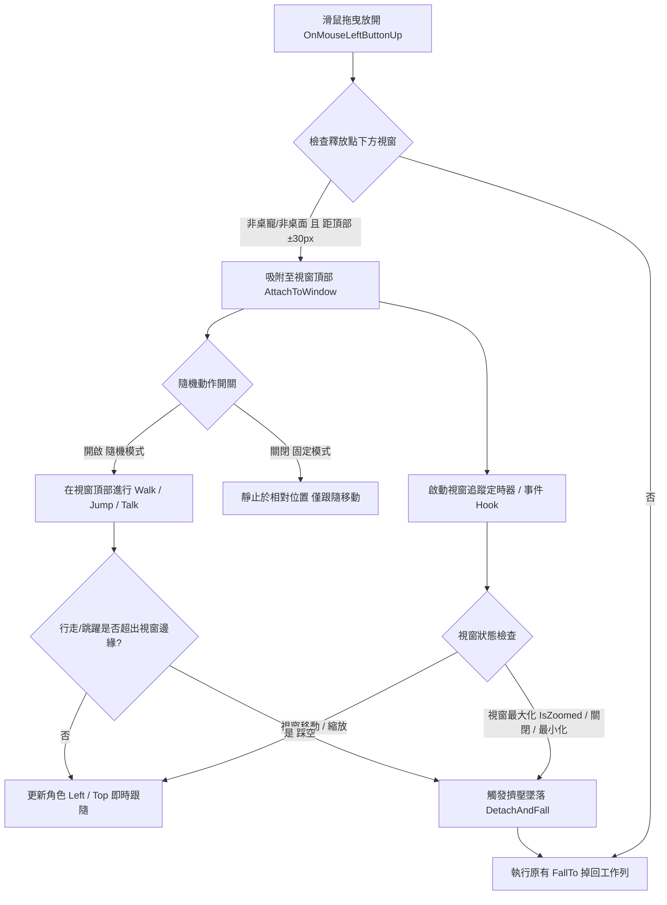

# ChiikawaDesktopPet (吉伊卡哇桌面寵物)

[](LICENSE.md)
[](https://dotnet.microsoft.com/download/dotnet/10.0)
[](#-開發與建置-development--build)

基於 **C# / .NET 10 WPF** 打造的高效能、輕量化吉伊卡哇桌面寵物應用程式。

本專案完全重構自社群開源的 Python/PyQt6 實作，具備極致輕量的執行體積、原生 Windows 桌面流暢度與完整的互動支援。

---

## 目錄 (Table of Contents)

* [✨ 特色功能 (Features)](#-特色功能-features)
* [📦 下載與安裝 (Download)](#-下載與安裝-download)
* [🚀 開發與建置 (Development & Build)](#-開發與建置-development--build)
* [🏗️ 專案架構 (Architecture)](#️-專案架構-architecture)
* [🔄 視窗吸附與行為互動流程 (Window Interaction Flow)](#-視窗吸附與行為互動流程-window-interaction-flow)
* [🎨 素材優化工具 (Asset Pipeline)](#-素材優化工具-asset-pipeline)
* [📄 授權與免責聲明 (License & Disclaimer)](#-授權與免責聲明-license--disclaimer)

---

## ✨ 特色功能 (Features)

* **輕量與原生體驗**：基於 .NET 10 WPF，以無邊框、背景透明、永遠置頂視窗呈現，單檔發布大小僅約 **2.3 MB**。
* **靜音辦公友善 (Office-Friendly)**：全域完全無突發音效干擾，安心在辦公室與專注工作環境中陪伴。
* **多位人氣與趣味角色完整登場（支援多實例召喚）**：吉伊卡哇 (Chiikawa)、小八貓 (Hachiware)、兔兔烏薩奇 (Usagi)、小桃 (Momonga)、獅薩 (Shisa)、自嘲熊 (JokeBear)、愛心兔 (LOVE RABBIT)、普羅 (Poro)、鏈鋸人 波奇塔 (Pochita)、貓貓蟲咖波 (Bugcat Capoo)、胸毛公寓 猴子朋友、胸毛公寓 哥布林喵喵怪、廢貓阿米 - 左手畫的 (Armi)、けたわん (Ketawan2)、天空饒舌歌手 (Sky Rapper)、總統-賴 (Lai) 等，每位角色皆有各自專屬的待機、漫遊與趣味彩蛋動作。
* **🤫 Boss Key 一鍵隱藏與解除封印 (Boss Key & Unseal Mode)**：
  * **一鍵緊急隱藏**：支援全域快捷鍵 **`Win + Alt + H`** 或點選任一角色右鍵選單最頂部的 **「一鍵隱藏」**，瞬間隱藏畫面上所有角色。
  * **凍結靜音低消耗**：隱藏期間所有角色完全凍結並暫停所有動畫、動作與計時器，不佔用 CPU 也不會彈出任何對話氣泡或系統通知。
  * **解除封印快速恢復**：角色隱藏後，系統匣右鍵選單最頂部將動態顯示 **「與你訂下約定的我命令你，封印解除!」**，點選該項目、**雙擊系統匣圖示**或**再次點擊啟動 exe** 即可解除封印並在原地恢復所有角色活動（在隱藏期間從系統匣「生成角色」或「匯入配置」亦會自動解除封印）。
* **🛡️ 單一實例保護 (Single Instance)**：
  * 限制程式單一執行個體，重複開啟 exe 時不會重複建立系統匣圖示或分散進程；若目前處於隱藏狀態則會自動喚醒並解除封印。
* **💾 角色配置匯出與匯入 (Profile Backup & Restore)**：
  * **一鍵備份配置**：可將目前畫面上所有召喚的角色、自訂對話文字、對齊方式、字體大小、永久對話框開關、角色縮放比例、預設待機動作、隨機動作開關與隨機跳躍開關完整匯出為 JSON 設定檔（預設檔名 `chiikawapet_profile.json`）。
  * **快速還原場景**：透過系統匣匯入設定檔，自動清空畫面並依序將保存的角色隨機分佈落下生成，精準套用所有外觀與對話設定。
* **🎭 雙人連動互動演繹 (Co-op Interactions)**：
  * 當 **Chiikawa** 與 **Momonga** 同時在場時，可從右鍵選單或系統匣觸發專屬的「【雙人互動】飛撲蹭臉」雙人連動演繹。
* **生動的自主行為與多實例支援**：
  * 角色會在桌面自主漫步、跳躍、發呆或進行特色動作演繹。
  * 支援同角色多隻召喚（如 Chiikawa 1, Chiikawa 2），各自分身獨立運作與設定。
* **豐富的滑鼠互動與獨立選單**：
  * **右鍵專屬功能表**：直接在角色上按右鍵可快速「一鍵隱藏」、手動觸發各項動作、指定預設動作、切換隨機跳躍/漫步、設定對話文字與格式。
  * **自訂預設待機動作 (Default Action)**：可指定喜愛的特定動作為待機循環動作，或一鍵還原為預設待機。
  * **對話框進階設定**：支援自訂對話文字、字體大小調整、置左/置中/置右對齊，以及「永久顯示對話框」模式。
  * **角色比例自由縮放 (Scale Adjustment)**：右鍵選單提供 50% ~ 200% 常用預設比例與 20% ~ 400% 自訂比例視窗，在大螢幕或高解析度螢幕上也能自由放大/縮小角色且維持清晰平滑畫質。
  * **拖曳移動**：隨意抓起角色放到螢幕任意位置。
  * **長按搖晃 (Hold-to-Shake)**：抓住太久角色會進入掙扎搖晃狀態。
  * **自由落體 (Fall-to-Ground)**：放開滑鼠後角色會受重力自然墜落並平穩著地於工作列頂部。
  * **視窗吸附與互動 (Window Snapping & Interaction)**：
    * **智慧吸附停靠**：將角色拖曳至任何一般應用程式視窗（如瀏覽器、記事本、IDE 等）頂部標題列邊緣釋放，角色會自動吸附並站立於視窗上緣。
    * **視窗即時跟隨**：無論是自由活動或取消隨機動作的「固定模式」，角色皆會即時跟隨視窗移動與縮放。
    * **邊緣踩空墜落**：在視窗上漫步或跳躍時，一旦超出視窗邊緣踩空，會立即中斷當前動作並切換為空中墜落動作掉回工作列。
    * **最大化擠壓與失效防護**：視窗最大化（頂部空間受擠壓）或視窗最小化/關閉時，角色自動解除吸附並安全墜落回工作列。
* **系統匣快捷控制 (System Tray)**：
  * 繁體中文右鍵功能表。
  * **解除封印**：角色隱藏時最頂端動態提供「與你訂下約定的我命令你，封印解除!」，亦支援雙擊系統匣圖示快速解除。
  * **生成角色**：可單獨生成特定角色或一鍵「生成所有角色」。
  * **配置備份與還原**：提供「匯出角色配置...」與「匯入角色配置...」。
  * **現在存活的角色**：即時檢視目前在場角色清單並支援個別踢出 (Kick)。
  * **播放動畫**：全域手動觸發指定角色之動作或雙人連動演繹。
  * **個別行為控制**：獨立切換各角色的隨機動畫與隨機跳躍。
  * **打招呼 (Say Hi)**：隨機或針對特定角色觸發對話氣泡與通知。
  * **多螢幕限制**：支援 **「限制角色只能在單一螢幕內移動」** 切換，友善多螢幕工作環境。
  * **系統通知整合**：支援 **「啟用 Windows 系統通知」** 開關（BalloonTip / Toast）。
* **高 DPI 與多螢幕校正**：具備螢幕座標轉換、多螢幕跨屏跳躍防漂移與工作列自動貼齊防穿透。

---

## 📦 下載與安裝 (Download)

目前尚未發布 GitHub Release，請至 [Releases](https://github.com/DAOjun0690/ChiikawaDesktopPet/releases) 頁面確認是否已有現成的執行檔可直接下載，或依照下方[開發與建置](#-開發與建置-development--build)章節的指令自行建置。

日後發布 Release 時，將提供以下兩種版本：

* **輕量單檔版**：需本機已安裝 [.NET 10 Desktop Runtime](https://dotnet.microsoft.com/download/dotnet/10.0)，總體積僅約 **50 MB**（已包含全部 16 位角色與連動動畫之高度壓縮封裝包，相較原本 160MB+ 體積縮減近 70%）。
* **自包含獨立版**：免安裝 .NET Runtime，開箱即用，總體積約 **110 MB**（原本約 180 MB）。
* **零磁碟碎檔**：全域 3,000+ 張圖檔已封裝為各角色獨立 `.zip`，WPF 執行時期使用記憶體串流直讀，不殘留磁碟暫存檔，啟動秒開。

---

## 🚀 開發與建置 (Development & Build)

### 需求條件
* [.NET 10.0 SDK](https://dotnet.microsoft.com/download/dotnet/10.0) 或更高版本
* Windows 10 / 11

### 本地執行
```powershell
dotnet run --project src/ChiikawaDesktopPet.Wpf
```

### 執行單元測試
```powershell
dotnet test src/ChiikawaDesktopPet.sln
```

### 發布專案 (Publish)

#### 1. 輕量單檔發布（需本機已安裝 .NET 10 Desktop Runtime，檔案體積僅約 2 MB，圖檔體積約 110 MB）
```powershell
dotnet publish src/ChiikawaDesktopPet.Wpf/ChiikawaDesktopPet.Wpf.csproj -c Release -r win-x64 --self-contained false -p:PublishSingleFile=true -o publish
```
發布後直接將 `publish/` 資料夾打包分享即可（產出 `ChiikawaDesktopPet.exe`）。

#### 2. 自包含獨立發布（無需安裝 .NET Runtime，總體積約 ~180 MB）
```powershell
dotnet publish src/ChiikawaDesktopPet.Wpf/ChiikawaDesktopPet.Wpf.csproj -c Release -r win-x64 --self-contained true -p:PublishSingleFile=true -p:IncludeNativeLibrariesForSelfExtract=true -o publish-standalone
```

> [!TIP]
> **可攜式 / 免安裝 SDK 開發者提示**：
> 若本機未全域安裝 .NET SDK，只需在終端機先指定環境變數即可直接編譯與執行：
> ```powershell
> $env:DOTNET_ROOT = "<你的 .NET 10 SDK 目錄>"
> $env:PATH = "$env:DOTNET_ROOT;$env:PATH"
> ```

---

## 🏗️ 專案架構 (Architecture)

```
src/
  ├── ChiikawaDesktopPet.Core/               純 C# 核心類別庫（無 UI 依賴，包含完全可單元測試的移動、跳躍、邊界判定、設定檔資料模型與 ProfileManager 邏輯）
  ├── ChiikawaDesktopPet.Core.Tests/         核心決策邏輯與 ProfileManager xUnit 單元測試
  ├── ChiikawaDesktopPet.Wpf/                WPF 桌面應用程式（系統匣控制、透明視窗、對話框、縮放與流暢動畫播放器）
  ├── ChiikawaDesktopPet.Wpf.Tests/          WPF 層元件與 Profile 套用單元測試
  ├── ChiikawaDesktopPet.AssetPipeline/      獨立素材批次重取樣與壓縮工具（Frame Resampling & Image Optimization）
  └── ChiikawaDesktopPet.AssetPipeline.Tests/素材處理管線單元測試
```

---

## 🔄 視窗吸附與行為互動流程 (Window Interaction Flow)



---

## 🎨 素材優化與打包工具 (Asset Pipeline)

內建專屬的素材處理管線工具，支援圖檔縮放、跳幀抽樣、8-bit 色盤量化與分角色 Zip 封裝：

### 1. 一鍵全域量化與封裝打包 (--pack)
將 `assets/optimized/` 中的所有角色與連動動畫自動進行 8-bit RGBA 色盤量化（pngquant / ImageSharp 雙模）並封裝成各角色獨立的 `.zip` 壓縮包（存放於 `assets/packs/`）：
```powershell
dotnet run --project src/ChiikawaDesktopPet.AssetPipeline -- --pack
```
> [!NOTE]
> **雙軌載入機制**：
> 主程式具備智慧雙軌載入能力——若目錄中存在散檔（如 `assets/chiikawa/`），則優先讀取本地資料夾方便即時改圖與開發除錯；若無散檔則自動載入 `assets/{character}.zip`，達成開發靈活、發布極致輕量的雙重優勢。

### 2. 單一角色素材重取樣與尺寸縮放
若有外部高解析度序列幀需加入專案，可透過下方指令限制最大長邊並抽幀：
```powershell
dotnet run --project src/ChiikawaDesktopPet.AssetPipeline -- <來源路徑> assets/optimized/<角色名稱> --max-dimension 320 --frame-stride 2
```

---

## 📄 授權與免責聲明 (License & Disclaimer)

* **免責聲明**：本專案為非營利之同人娛樂、迷因趣味與學習專案。
  * 「吉伊卡哇 (Chiikawa / なんか小さくてかわいいやつ)」及「自嘲熊 (JokeBear)」等作品與角色形象之智慧財產權均屬原作者 **Nagano (ナガノ)** 所有。
  * 「LOVE RABBIT (愛心兔)」角色形象之智慧財產權屬原作者 **Nishimura Yuji (西村裕二)** 所有。請支持正版貼圖與作品！
  * 「普羅 (Poro)」角色形象之智慧財產權屬 **Riot Games** 所有。
  * 「波奇塔 (Pochita / ポチタ)」及《鏈鋸人 (Chainsaw Man)》作品與角色形象之智慧財產權屬原作者 **藤本樹 (Fujimoto Tatsuki) / 集英社** 所有。
  * 「廢貓阿米 (Armi - 左手畫的)」角色形象之智慧財產權屬原作者所有。請支持原創插畫作品與貼圖！
  * 專案內包含之公眾人物迷因角色（如「總統-賴」）純屬社群梗圖娛樂與技術展示，不具任何政治用途或政治立場。
* **原專案致謝**：本專案的動作參數與最初素材整理參考自 [gitChara-dot/Yaha-Pet](https://github.com/gitChara-dot/Yaha-Pet) 的 Python/PyQt6 開源實作，特此致謝。
* **授權條款**：本專案程式碼依據 [MIT License](LICENSE.md) 授權釋出。
