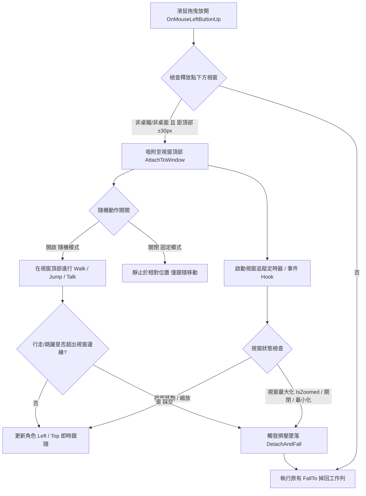

# ChiikawaDesktopPet (吉伊卡哇桌面寵物)

[](LICENSE.md)
[](https://dotnet.microsoft.com/download/dotnet/10.0)
[](#-開發與建置-development--build)

基於 **C# / .NET 10 WPF** 打造的高效能、輕量化吉伊卡哇桌面寵物應用程式。

本專案完全重構自社群開源的 Python/PyQt6 實作，具備極致輕量的執行體積、原生 Windows 桌面流暢度與完整的互動支援。

---

## 目錄 (Table of Contents)

* [✨ 特色功能 (Features)](#-特色功能-features)
* [🥁 Bongo 打字pet 專區 (Bongo Cat Pet)](#-bongo-打字pet-專區-bongo-cat-pet)
* [📦 下載與安裝 (Download)](#-下載與安裝-download)
* [🚀 開發與建置 (Development & Build)](#-開發與建置-development--build)
* [🏗️ 專案架構 (Architecture)](#️-專案架構-architecture)
* [🔄 視窗吸附與行為互動流程 (Window Interaction Flow)](#-視窗吸附與行為互動流程-window-interaction-flow)
* [🎨 素材優化工具 (Asset Pipeline)](#-素材優化工具-asset-pipeline)
* [📄 授權與免責聲明 (License & Disclaimer)](#-授權與免責聲明-license--disclaimer)

---

## ✨ 特色功能 (Features)

* **輕量與原生體驗**：基於 .NET 10 WPF，以無邊框、背景透明、永遠置頂視窗呈現，單檔發布大小僅約 **2.3 MB**。
* **靜音辦公友善 (Office-Friendly)**：全域完全無突發音效干擾，安心在辦公室與專注工作環境中陪伴。
* **多位人氣與趣味角色完整登場（支援多實例召喚）**：吉伊卡哇 (Chiikawa)、小八貓 (Hachiware)、兔兔烏薩奇 (Usagi)、小桃 (Momonga)、獅薩 (Shisa)、自嘲熊 (JokeBear)、愛心兔 (LOVE RABBIT)、普羅 (Poro)、鏈鋸人 波奇塔 (Pochita)、貓貓蟲咖波 (Bugcat Capoo)、胸毛公寓 猴子朋友、胸毛公寓 哥布林喵喵怪、LV.67 野生喵喵怪(屬性:皇上)、LV.76 野生喵喵怪(屬性:狗狗)、精靈寶可夢 百變怪 (Ditto)、奶龍 (Nai Long)、廢貓阿米 - 左手畫的 (Armi)、けたわん (Ketawan2)、天空饒舌歌手 (Sky Rapper)、線條小狗 (Maltese Puppy)、總統-賴 (Lai) 等，每位角色皆有各自專屬的待機、漫遊與趣味彩蛋動作。
* **🤫 Boss Key 一鍵隱藏與解除封印 (Boss Key & Unseal Mode)**：
  * **一鍵緊急隱藏**：支援全域快捷鍵 **`Win + Alt + H`** 或點選任一角色右鍵選單最頂部的 **「一鍵隱藏」**，瞬間隱藏畫面上所有角色（含桌寵與 Bongo 打字pet）。
  * **凍結靜音低消耗**：隱藏期間所有角色完全凍結並暫停所有動畫、動作、鍵鼠監聽與計時器，不佔用 CPU 也不會彈出任何對話氣泡或系統通知。
  * **解除封印快速恢復**：角色隱藏後，系統匣右鍵選單最頂部將動態顯示 **「與你訂下約定的我命令你，封印解除!」**，點選該項目、**雙擊系統匣圖示**或**再次點擊啟動 exe** 即可解除封印並在原地恢復所有角色活動（在隱藏期間從系統匣「生成角色」或「匯入配置」亦會自動解除封印）。
* **🛡️ 單一實例保護 (Single Instance)**：
  * 限制程式單一執行個體，重複開啟 exe 時不會重複建立系統匣圖示或分散進程；若目前處於隱藏狀態則會自動喚醒並解除封印。
* **💾 角色配置匯出與匯入 (Profile Backup & Restore)**：
  * **一鍵備份配置**：可將目前畫面上所有召喚的角色、自訂對話文字、對齊方式、字體大小、永久對話框開關、角色縮放比例、預設待機動作、隨機動作開關、隨機跳躍開關，以及 **Bongo 打字pet 之啟用狀態、造型選擇、自訂縮放、多螢幕座標位置、鎖定狀態與滑鼠穿透設定** 完整匯出為 JSON 設定檔（預設檔名 `chiikawapet_profile.json`）。
  * **快速還原場景**：透過系統匣匯入設定檔，自動清空畫面並依序將保存的角色隨機分佈落下生成，精準套用所有外觀、對話與打字pet配置。
* **🥁 Bongo 打字pet (Bongo Cat Pet - 全域打字互動掛件)**：
  * **雙角色架構分流**：與自由漫遊的桌寵完全獨立，畫面上維持全域唯一的專屬打字pet，專職即時鍵盤敲擊與打字反饋。
  * **180° 相對桌面視角與 75% 機械鍵盤物理定位**：模擬角色於桌子對面望向使用者的視角，空白鍵在最上方、數字鍵在最下方；**實體鍵盤左下角之 Ctrl 鍵精準映射至打字pet畫面的最右上角**，敲擊位置嚴謹真實。
  * **真即時「按住保持 (Hold Down Until Release)」機制**：告別假動作計時器！鍵盤與滑鼠按下肉爪即時下壓，按住持續貼緊，放開按鍵即時回彈原位。
  * **滑鼠軌跡與點擊自然鏡向 (Mirror Tracking & Clicks)**：滑鼠左右移動與左右鍵點擊全面依據對坐視角進行物理鏡向映射。
  * **四大人氣專屬分層造型 (4 Official Skins)**：內建 **吉伊卡哇 (Chiikawa)**、**小八貓 (Hachiware)**、**兔兔烏薩奇 (Usagi)** 及 **胸毛公寓 猴子朋友 (Chesthair Monkey)** 4 種官方高畫質 2D 分層造型，並支援資料夾擴充自訂造型。
  * **階梯式表情與過載特效 (Overdrive)**：依據全域即時每分鐘打字次數 (CPM) 平滑切換表情——輕鬆發呆 ➔ 專注敲打 (120+ CPM) ➔ 狂暴過載 (300+ CPM，含專屬尖叫表情與全彩過載光效)。
  * **智慧滑鼠穿透與全域多螢幕支援**：支援點擊穿透且穿透時依然可右鍵喚出功能表；支援任意拖曳至副螢幕或負座標延伸螢幕，並具備全虛擬桌面邊界保護。
  * 詳見下文 [🥁 Bongo 打字pet 專區](#-bongo-打字pet-專區-bongo-cat-pet) 完整說明。
* **🎭 雙人連動互動演繹 (Co-op Interactions)**：
  * 當 **Chiikawa** 與 **Momonga** 同時在場時，可從右鍵選單或系統匣觸發專屬的「【雙人互動】飛撲蹭臉」雙人連動演繹。
* **生動的自主行為與多實例支援**：
  * 角色會在桌面自主漫步、跳躍、發呆或進行特色動作演繹。
  * 支援同角色多隻召喚（如 Chiikawa 1, Chiikawa 2），各自分身獨立運作與設定。
* **豐富的滑鼠互動與獨立選單**：
  * **右鍵專屬功能表**：直接在角色上按右鍵可快速「一鍵隱藏」、手動觸發各項動作、指定預設動作、切換隨機跳躍/漫步、設定對話文字與格式。
  * **自訂預設待機動作 (Default Action)**：可指定喜愛的特定動作為待機循環動作，或一鍵還原為預設待機。
  * **對話框進階設定**：支援自訂對話文字、字體大小調整、置左/置中/置右對齊，以及「永久顯示對話框」模式。
  * **角色比例自由縮放 (Scale Adjustment)**：右鍵選單提供 50% ~ 200% 常用預設比例與 20% ~ 400% 自訂比例視窗，在大螢幕或高解析度螢幕上也能自由放大/縮小角色且維持清晰平滑畫質。
  * **拖曳移動**：隨意抓起角色放到螢幕任意位置。
  * **長按搖晃 (Hold-to-Shake)**：抓住太久角色會進入掙扎搖晃狀態。
  * **自由落體 (Fall-to-Ground)**：放開滑鼠後角色會受重力自然墜落並平穩著地於工作列頂部。
  * **視窗吸附與互動 (Window Snapping & Interaction)**：
    * **智慧吸附停靠**：將角色拖曳至任何一般應用程式視窗（如瀏覽器、記事本、IDE 等）頂部標題列邊緣釋放，角色會自動吸附並站立於視窗上緣。
    * **視窗即時跟隨**：無論是自由活動或取消隨機動作的「固定模式」，角色皆會即時跟隨視窗移動與縮放。
    * **邊緣踩空墜落**：在視窗上漫步或跳躍時，一旦超出視窗邊緣踩空，會立即中斷當前動作並切換為空中墜落動作掉回工作列。
    * **最大化擠壓與失效防護**：視窗最大化（頂部空間受擠壓）或視窗最小化/關閉時，角色自動解除吸附並安全墜落回工作列。
* **系統匣快捷控制 (System Tray)**：
  * 繁體中文右鍵功能表。
  * **解除封印**：角色隱藏時最頂端動態提供「與你訂下約定的我命令你，封印解除!」，亦支援雙擊系統匣圖示快速解除。
  * **生成角色**：可單獨生成特定角色或一鍵「生成所有角色」。
  * **配置備份與還原**：提供「匯出角色配置...」與「匯入角色配置...」。
  * **現在存活的角色**：即時檢視目前在場角色清單並支援個別踢出 (Kick)。
  * **播放動畫**：全域手動觸發指定角色之動作或雙人連動演繹。
  * **個別行為控制**：獨立切換各角色的隨機動畫與隨機跳躍。
  * **打招呼 (Say Hi)**：隨機或針對特定角色觸發對話氣泡與通知。
  * **多螢幕限制**：支援 **「限制角色只能在單一螢幕內移動」** 切換，友善多螢幕工作環境。
  * **系統通知整合**：支援 **「啟用 Windows 系統通知」** 開關（BalloonTip / Toast）。
  * 🥁 **Bongo 打字pet 專屬功能表**：支援在系統匣直接切換「啟用 Bongo 打字pet」、「更換造型 (4大官方造型 + 自訂)」、「操作模式 (鍵鼠並用 / 雙手純鍵盤)」、「追蹤滑鼠軌跡」、「滑鼠穿透 (點擊穿透)」與「重設位置至右下角」。
* **高 DPI 與多螢幕校正**：具備螢幕座標轉換、多螢幕跨屏跳躍防漂移與工作列自動貼齊防穿透。

---

## 🥁 Bongo 打字pet 專區 (Bongo Cat Pet)

為廣大打字愛好者、工程師與文案創作者打造的全域即時打字互動小夥伴！與桌面自主漫遊的角色完全解耦，以最乾淨的透明視窗靜置於桌面一角或工作列上方，即時反映使用者的鍵盤與滑鼠敲擊動作。

### 🌟 核心特色一覽

| 特色機制 | 功能說明 |
| :--- | :--- |
| **🎮 180° 相對桌面佈局** | 依據對坐視角設計，鍵盤依 180° 倒置映射（空白鍵在頂、數字/Esc 在底），**左下角 Ctrl 精準落於右上角**，打擊位置真實細膩。 |
| **✋ 按住保持機制** | 真正依據 Win32 `KeyDown`/`KeyUp` 與 `MouseDown`/`MouseUp` 監聽，按鍵長按時肉爪緊貼不放，鬆開後平滑回彈原位。 |
| **🖱️ 鏡向滑鼠追蹤與點擊** | 滑鼠移動採用自然鏡像演算（游標往右、爪子往畫面左移），滑鼠左右鍵點擊依視角精準鏡向（左鍵對應畫面右鍵、右鍵對應畫面左鍵）。 |
| **⚡ 階梯式表情反饋 (CPM)** | 滑動窗口即時計算每分鐘按鍵頻率：<br>• **輕鬆發呆 (Idle: 0~120 CPM)**：微笑待機。<br>• **專注敲打 (Focused: 120~300 CPM)**：凝神敲擊。<br>• **狂暴過載 (Overdrive: 300+ CPM)**：飆汗/大尖叫表情與全彩過載光效！ |
| **🖥️ 全虛擬螢幕多屏支援** | 完美支援多螢幕與負座標延伸螢幕自由拖曳放置，內建螢幕邊界自動安全夾持，重啟或匯入配置永不跑位。 |
| **👻 智慧滑鼠穿透** | 啟用「滑鼠穿透」模式後游標可直接點擊操作背景視窗；獨家低階攔截技術讓您**依然能在打字pet身上點擊右鍵喚出完整選單**！ |
| **🔄 雙操作模式自由切換** | • **鍵鼠並用 (預設)**：左爪握滑鼠跟隨游標軌跡與左右點擊，右爪在 75% 鍵盤精準位移敲擊。<br>• **雙手純鍵盤**：左右分區，左手敲擊左半鍵盤，右手敲擊右半鍵盤，極速打字時雙爪如幻影交替。 |
| **🎛️ 自由縮放與鎖定** | 支援預設 50% ~ 200% 常用比例與 20% ~ 400% 數值自訂縮放；支援一鍵「鎖定位置」防止誤拖曳。 |

---

### 🎨 四大官方精選造型 (Official Skins)

內建 4 種以高品質向量風格手工繪製之分層造型包，支援由右鍵選單或系統匣隨時無縫秒切換：

1. **🌸 吉伊卡哇 (Chiikawa)**
   * **特色**：純真無邪、惹人憐愛。
   * **表情演繹**：平時以呆萌微笑陪伴；打字加速時神情堅毅認真；超頻狂暴 (300+ CPM) 時眼泛淚光、汗水狂飆！
2. **🐟 小八貓 (Hachiware)**
   * **特色**：招牌藍色八字頭，靈活樂觀的元氣夥伴。
   * **表情演繹**：一般狀態下精神飽滿；打字加速時目光專注俐落；超頻時展現奮力拚搏的燃燒神情！
3. **🐰 兔兔烏薩奇 (Usagi)**
   * **特色**：古靈精怪、元氣爆棚的怪叫兔子。
   * **表情演繹**：平時自信微笑；加速敲打時眼神銳利；超頻時切換為招牌「Scream 大喊叫」張嘴神情，並爆發熱血過載光效！
4. **🐵 胸毛公寓 猴子朋友 (Chesthair Monkey)**
   * **特色**：社群超人氣生成角色隆重入駐打字pet！經典標誌紅臉腮紅與捲尾造型。
   * **表情演繹**：平時憨厚專注敲打；超頻暴走時爆發魔性大尖叫表情，充滿滿滿的魔性喜感！

> [!TIP]
> **DIY 自訂造型擴充**：
> 打字pet採用高擴充性的分層規格。只需在 `assets/bongo/{skin_key}/` 新增資料夾並放入 `manifest.json` 與各部位圖檔（`body.png`, `left_up.png`, `left_down.png`, `face_normal.png`, `face_focused.png`, `face_overdrive.png`, `effect_overdrive.png`），主程式即會自動辨識並列於選單中！

---

## 📦 下載與安裝 (Download)

目前尚未發布 GitHub Release，請至 [Releases](https://github.com/DAOjun0690/ChiikawaDesktopPet/releases) 頁面確認是否已有現成的執行檔可直接下載，或依照下方[開發與建置](#-開發與建置-development--build)章節的指令自行建置。

日後發布 Release 時，將提供以下兩種版本：

* **輕量單檔版**：需本機已安裝 [.NET 10 Desktop Runtime](https://dotnet.microsoft.com/download/dotnet/10.0)，總體積僅約 **55 MB**（已包含全部 21 位角色與連動動畫之高度壓縮封裝包，相較原本 160MB+ 體積縮減近 70%）。
* **自包含獨立版**：免安裝 .NET Runtime，開箱即用，總體積約 **110 MB**（原本約 180 MB）。
* **零磁碟碎檔**：全域 3,000+ 張圖檔已封裝為各角色獨立 `.zip`，WPF 執行時期使用記憶體串流直讀，不殘留磁碟暫存檔，啟動秒開。

---

## 🚀 開發與建置 (Development & Build)

### 需求條件
* [.NET 10.0 SDK](https://dotnet.microsoft.com/download/dotnet/10.0) 或更高版本
* Windows 10 / 11

### 本地執行
```powershell
dotnet run --project src/ChiikawaDesktopPet.Wpf
```

### 執行單元測試
```powershell
dotnet test src/ChiikawaDesktopPet.sln
```

### 發布專案 (Publish)

#### 1. 輕量單檔發布（需本機已安裝 .NET 10 Desktop Runtime，檔案體積僅約 2 MB，圖檔體積約 110 MB）
```powershell
dotnet publish src/ChiikawaDesktopPet.Wpf/ChiikawaDesktopPet.Wpf.csproj -c Release -r win-x64 --self-contained false -p:PublishSingleFile=true -o publish
```
發布後直接將 `publish/` 資料夾打包分享即可（產出 `ChiikawaDesktopPet.exe`）。

#### 2. 自包含獨立發布（無需安裝 .NET Runtime，總體積約 ~180 MB）
```powershell
dotnet publish src/ChiikawaDesktopPet.Wpf/ChiikawaDesktopPet.Wpf.csproj -c Release -r win-x64 --self-contained true -p:PublishSingleFile=true -p:IncludeNativeLibrariesForSelfExtract=true -o publish-standalone
```

> [!TIP]
> **可攜式 / 免安裝 SDK 開發者提示**：
> 若本機未全域安裝 .NET SDK，只需在終端機先指定環境變數即可直接編譯與執行：
> ```powershell
> $env:DOTNET_ROOT = "<你的 .NET 10 SDK 目錄>"
> $env:PATH = "$env:DOTNET_ROOT;$env:PATH"
> ```

---

## 🏗️ 專案架構 (Architecture)

```
src/
  ├── ChiikawaDesktopPet.Core/               純 C# 核心類別庫（無 UI 依賴，包含移動、跳躍、邊界判定、75% 鍵盤映射 BongoKeyboardLayout、打字速度追蹤器 BongoSpeedTracker、設定檔資料模型與 ProfileManager）
  ├── ChiikawaDesktopPet.Core.Tests/         核心決策邏輯、鍵位映射、速度追蹤與 ProfileManager xUnit 單元測試 (107 項全數通過)
  ├── ChiikawaDesktopPet.Wpf/                WPF 桌面應用程式（系統匣、桌寵視窗、Bongo 打字pet視窗、全域鍵鼠 Hook、ClickThroughManager、對話框與流暢動畫播放器）
  ├── ChiikawaDesktopPet.Wpf.Tests/          WPF 層元件、Bongo 造型管理、整合測試與 Profile 套用單元測試 (283 項全數通過)
  ├── ChiikawaDesktopPet.AssetPipeline/      獨立素材批次重取樣與壓縮工具（Frame Resampling & Image Optimization）
  └── ChiikawaDesktopPet.AssetPipeline.Tests/素材處理管線單元測試 (11 項全數通過)
```

---

## 🔄 視窗吸附與行為互動流程 (Window Interaction Flow)



---

## 🎨 素材優化與打包工具 (Asset Pipeline)

內建專屬的素材處理管線工具，支援圖檔縮放、跳幀抽樣、8-bit 色盤量化與分角色 Zip 封裝：

### 1. 一鍵全域量化與封裝打包 (--pack)
將 `assets/optimized/` 中的所有角色與連動動畫自動進行 8-bit RGBA 色盤量化（pngquant / ImageSharp 雙模）並封裝成各角色獨立的 `.zip` 壓縮包（存放於 `assets/packs/`）：
```powershell
dotnet run --project src/ChiikawaDesktopPet.AssetPipeline -- --pack
```
> [!NOTE]
> **雙軌載入機制**：
> 主程式具備智慧雙軌載入能力——若目錄中存在散檔（如 `assets/chiikawa/`），則優先讀取本地資料夾方便即時改圖與開發除錯；若無散檔則自動載入 `assets/{character}.zip`，達成開發靈活、發布極致輕量的雙重優勢。

### 2. 單一角色素材重取樣與尺寸縮放
若有外部高解析度序列幀需加入專案，可透過下方指令限制最大長邊並抽幀：
```powershell
dotnet run --project src/ChiikawaDesktopPet.AssetPipeline -- <來源路徑> assets/optimized/<角色名稱> --max-dimension 320 --frame-stride 2
```

---

## 📄 授權與免責聲明 (License & Disclaimer)

* **免責聲明**：本專案為非營利之同人娛樂、迷因趣味與學習專案。所有第三方角色素材與商標版權均屬原作者或其合法權利人所有，請支持正版貼圖與官方周邊！
  * 「吉伊卡哇 (Chiikawa / なんか小さくてかわいいやつ)」及「自嘲熊 (JokeBear)」等作品與角色形象之智慧財產權均屬原作者 **Nagano (ナガノ)** 所有。
  * 「線條小狗 (Maltese Puppy)」及其夥伴小金毛等作品與角色形象之智慧財產權均屬原作者 **moonlab_studio (文鍾範)** 所有。
  * 「貓貓蟲咖波 (Bugcat Capoo)」角色形象之智慧財產權均屬原作者 **亞拉 (Yara) / 卡特島創意** 所有。
  * 「LOVE RABBIT (愛心兔)」角色形象之智慧財產權屬原作者 **Nishimura Yuji (西村裕二)** 所有。
  * 「けたわん (Ketawan / けたたまわんこ)」角色形象之智慧財產權屬原作者 **たかだべあ (Takadabear)** 所有。
  * 「胸毛公寓」系列角色（猴子朋友、野生喵喵怪/哥布林喵喵怪）形象之智慧財產權均屬原作者 **胸毛公寓** 所有。
  * 「普羅 (Poro)」角色形象之智慧財產權屬 **Riot Games** 所有。
  * 「波奇塔 (Pochita / ポチタ)」及《鏈鋸人 (Chainsaw Man)》作品與角色形象之智慧財產權屬原作者 **藤本樹 (Fujimoto Tatsuki) / 集英社** 所有。
  * 「廢貓阿米 (Armi - 左手畫的)」角色形象之智慧財產權屬原作者所有。
  * 「奶龍 (Nai Long)」及其系列作品與角色形象之智慧財產權均屬原作者／出品方 **第七印象文化傳媒 (Seventh Impression)** 及官方授權方 **羚邦娛樂 (Medialink)** 所有。動態貼圖素材取自 LINE STORE 官方發行貼圖。
  * 「Sky Rapper (天空饒舌歌手)」屬社群網路迷因原創動畫形象。
  * 專案內包含之公眾人物迷因角色（如「總統-賴」）純屬社群梗圖娛樂與技術展示，不具任何政治用途或政治立場。
* **原專案與創意致謝**：本專案的動作參數與最初素材整理參考自 [gitChara-dot/Yaha-Pet](https://github.com/gitChara-dot/Yaha-Pet) 的 Python/PyQt6 開源實作；全域打字互動掛件創意靈感致敬經典社群迷因 **Bongo Cat**，特此致謝。
* **授權條款**：本專案程式碼依據 [MIT License](LICENSE.md) 授權釋出。
